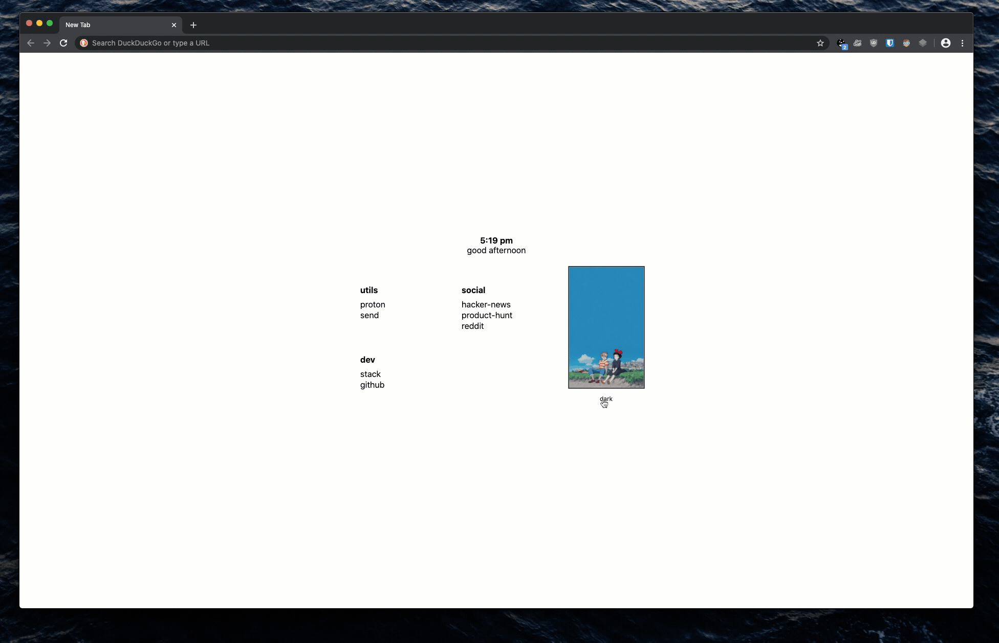
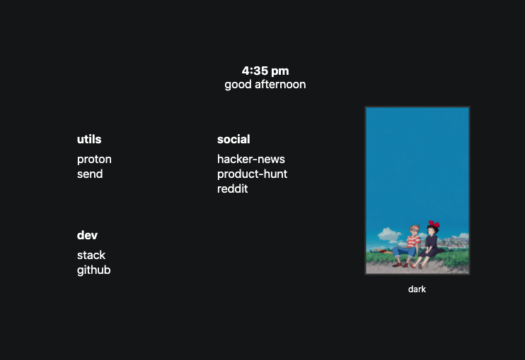
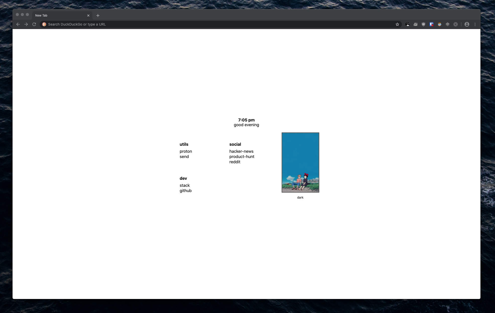

# Minimal new tab page
</img>

### Features: 
- Time
- Greeting
- Dark mode toggle (stored in localstorage)

Based on: ["simple start page" by: Mariusz Z](https://stpg.tk/guides/basic-startpage)
### How to install?
- [Video for Chromium browsers](https://vimeo.com/436572024)
- [Firefox written tutorial](https://support.mozilla.org/en-US/questions/1251199)
- [Chromium written tutorial](https://developer.chrome.com/extensions/override)

### How to change links?
Edit the index.html to include any links you want.

```html
 <ul>
  <li>utils</li> // this is the title for the links 
  <li><a href="https://www.protonmail.com/login">proton</a></li>
  <li><a href="https://send.firefox.com/">send</a></li>
</ul>
```

#### Screens:
</img>
</img>

