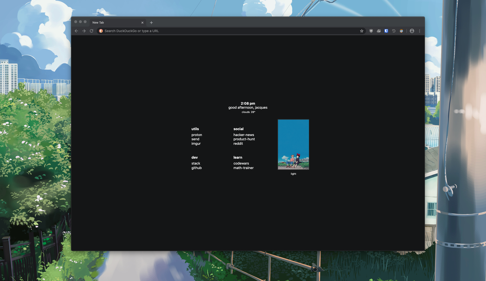
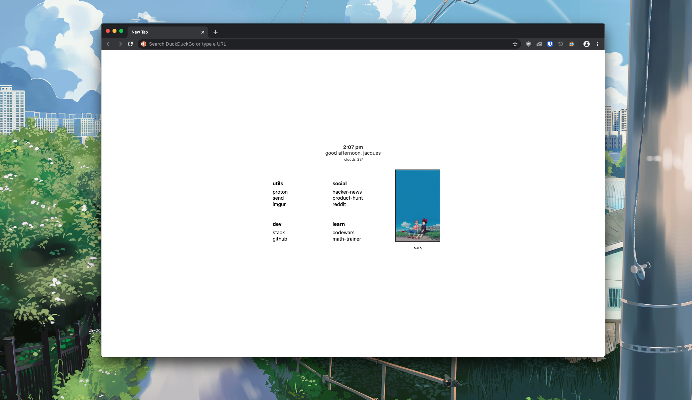

<h1>🖼  minimal-tab</h1>
<br>

</img>

## Features: 
- Time
- Greeting
- Dark mode toggle (stored in localstorage)
- Weather (temp & info)

Based on: ["simple start page" by: Mariusz Z](https://stpg.tk/guides/basic-startpage)
### How to install?
- [Video for Chromium browsers](https://vimeo.com/436572024)
- [Firefox written tutorial](https://support.mozilla.org/en-US/questions/1251199)
- [Chromium written tutorial](https://developer.chrome.com/extensions/override)

### How to setup weather?

First you will need to generate an api key from [openweathermap](https://openweathermap.org/api). Then find out what the city id is for your location. Ex:`London = 2643743`.

Create a `config.js` file that will house these values.

#### Config.js:

```javascript
let config = {
    API_KEY: "your_key",
    CITY_ID: "your_city_id"
}
```

### Structure:

```html
 <ul>
  <li>utils</li><!--Title for the links-->
  <li><a href="https://www.protonmail.com/login">proton</a></li><!--Individual Link-->
  <li><a href="https://send.firefox.com/">send</a></li><!--Individual Link-->
</ul>
```

### Screens:
</img>
<hr>
</img>

#### [imgur](https://imgur.com/a/ZlQtX3y)
